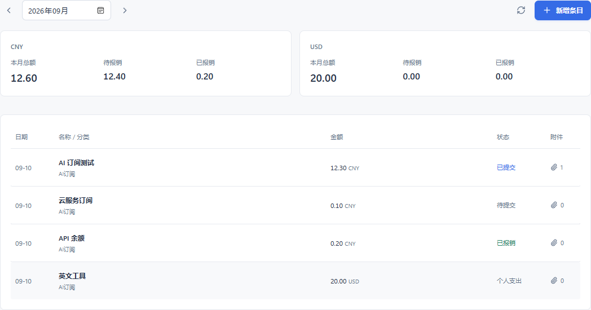
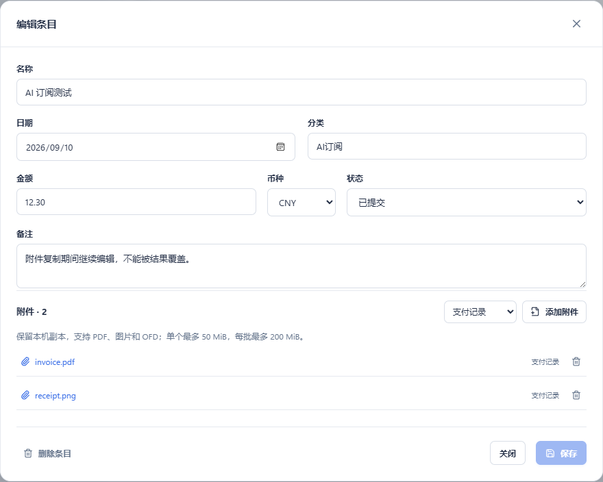

# WinToolbox 0.1.10：按月记账

新增“记账”工具，用于 AI 订阅和其他报销费用。按费用日期归入月份，每笔记录可填写名称、金额、币种、分类、报销状态和备注。

## 使用

1. 打开记账，选择月份，点击新增。
2. 填写费用名称、发生日期和金额；默认人民币，美元等费用按各自币种统计。
3. 保存后添加附件。发票、收据和支付记录可以放在同一笔费用内，支持多个文件。
4. 报销提交后改为“已提交”，到账后改为“已报销”；不报销的个人费用可单独标记。
5. 点击附件名称使用本机程序打开；条目和附件均可删除，删除前会确认。

附件会复制到应用数据目录，保留原文件。修改日期后条目会进入对应月份。不同币种分别汇总，不自动换算或叠加。

## 备份与同步

记账条目与附件保存在 `data/expenses`，随本地备份和 WebDAV 快照一起迁移；即使不勾选媒体缓存，票据文件仍会包含。上传或恢复方式沿用设置中的 WebDAV 同步。恢复快照会替换其包含的数据，恢复前自动保留本地备份。

删除记录采用归档方式，原始附件源文件不受影响。归档数据随备份保存，目前没有独立的回收站界面。

## 验证

192 项现有及备份集成测试全量通过；随后新增的记账专项与备份测试共 27 项通过。前端 29 项金额、日期和状态断言、29 项隔离交互检查通过；1280/940 宽度无横向溢出。未导入或修改用户真实账单。

0.1.10 原生 release 构建已完成（JS index-Bt1WH4Et.js），随包 Python 的真实 JSON-RPC app.info / expenses.list 冒烟检查通过。当前 Windows 桌面锁屏并显示终端安全策略提示，按 Computer Use 操作规范暂停原生操作。旧版 WinToolbox 仍运行，固定便携目录尚未覆盖；解锁后退出旧版，执行 scripts/package.ps1 -PortableOnly -SkipInstall 并完成原生记账表单验收。现有数据保持不变。

后续交付：本功能已随 0.1.11 一并更新到固定免安装目录，之前等待解锁的打包步骤已完成。详见 RELEASE-0.1.11.md。
