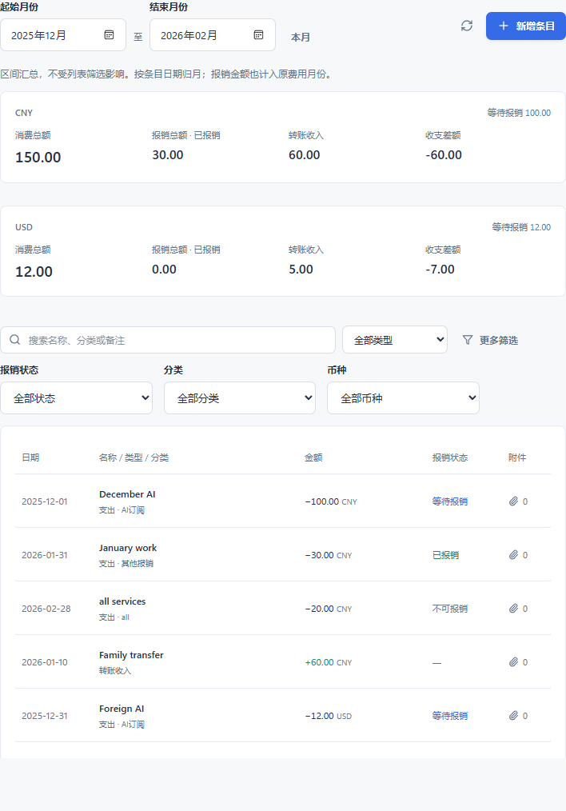
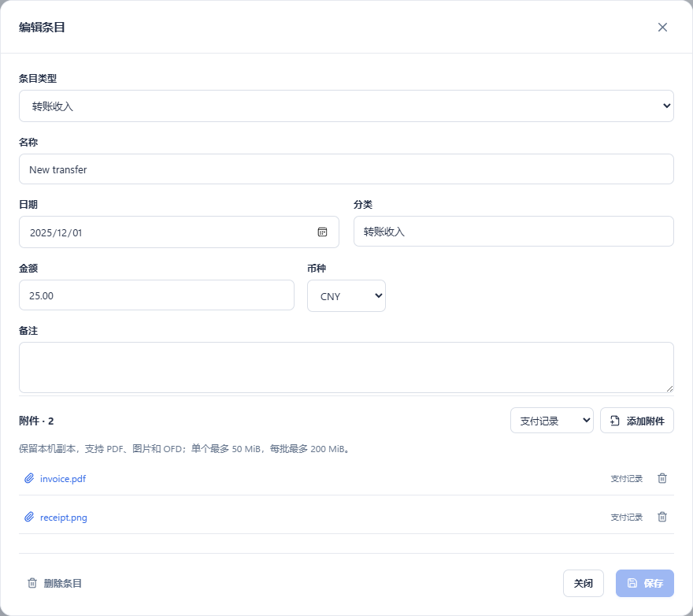

# WinToolbox 0.1.12：收支与月份区间

记账新增“转账收入”类型，与支出在同一列表中管理。两种条目都可记录日期、金额、分类、备注和附件；转账收入不计入消费或报销金额。

在页面顶部选择起止月份，例如 2026-07 至 2026-09，统计包含 7、8、9 月。列表可按关键词、支出/转账收入、报销状态、分类和币种筛选。区间汇总不受列表筛选影响。

支出的报销状态统一为“等待报销、已报销、不可报销”。旧条目的待提交、已提交归为等待报销，个人支出归为不可报销；原记录和附件保留。收入条目不显示报销状态。

每种币种分别计算：

| 指标 | 计算范围 |
| --- | --- |
| 消费总金额 | 区间内全部支出，含不可报销支出 |
| 报销总金额 | 区间内标记为已报销的支出 |
| 转账收入 | 区间内收入条目 |
| 收支差额 | 转账收入＋已报销金额－消费总金额 |

差额为负表示仍有净支出，为正表示收入与报销超过消费。所有统计按条目日期归属月份；报销金额按原费用日期归属，不代表报销实际到账月份。金额精确到分，不跨币种换算。

使用示例：新增“共用订阅分摊款”，类型选“转账收入”，填到账日期和金额，可附转账截图；订阅扣款另建支出条目。选择同一月份区间即可比对收支。

账本继续保存在原 `data/expenses`，随本地备份和 WebDAV 快照同步。

验证：256 项 Python 全量测试通过，其中记账及备份专项 53 项。验证包含跨年起止月份、不同币种独立计算、收入/支出来回切换、负数差额精确到分、筛选后区间总额保持不变，以及收入附件和旧状态在备份恢复后的完整性。

前端构建通过，53 项状态断言、36 项隔离界面检查通过，1280/940 宽度无横向溢出。固定免安装版已更新并启动为 0.1.12，更新前后 19 个原数据文件校验一致。原生页面已检查起止月份、搜索、更多筛选及新增条目的支出/转账收入选项，未写入测试账单。

