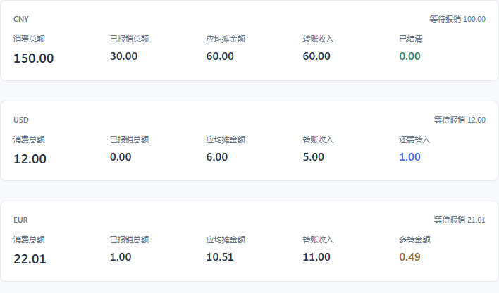

# WinToolbox 0.1.13：均摊对账

进入“记账”，选择起止月份，即可查看该区间的均摊和转账情况。

**应均摊金额＝（消费总额－已报销总额）÷2。**

将应均摊金额与转账收入比较，页面直接显示“还需转入”“多转金额”或“已结清”。例如消费 1,000 元、已报销 200 元，应均摊 400 元：

| 已转入 | 对账结果 |
| --- | --- |
| 300 元 | 还需转入 100 元 |
| 400 元 | 已结清 |
| 450 元 | 多转金额 50 元 |

等待报销的费用暂不扣除；改为已报销后会重新计算。不可报销支出也计入消费总额。先合计整个区间，再除以 2，按分四舍五入；例如 10.01 元减去报销 2 元，应均摊 4.01 元。

区间包含起止月份，汇总不受列表筛选影响，各币种单独计算。报销金额仍按原费用的条目日期归月。

原有条目、附件和数据目录保留，备份或 WebDAV 恢复后自动按同一规则重新统计。

验证：63 项记账与备份测试、66 项前端状态断言、17 项隔离界面检查通过。覆盖跨月合计后再均摊、半分钱四舍五入、少转/多转/结清、筛选不改变汇总及恢复后金额一致；1280 和 940 宽度均无金额溢出。固定免安装版已更新至 0.1.13 并打开记账页，原 19 个数据文件校验一致，未写入测试账单。
