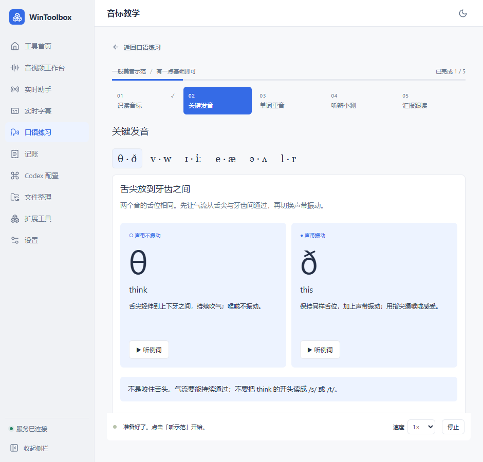
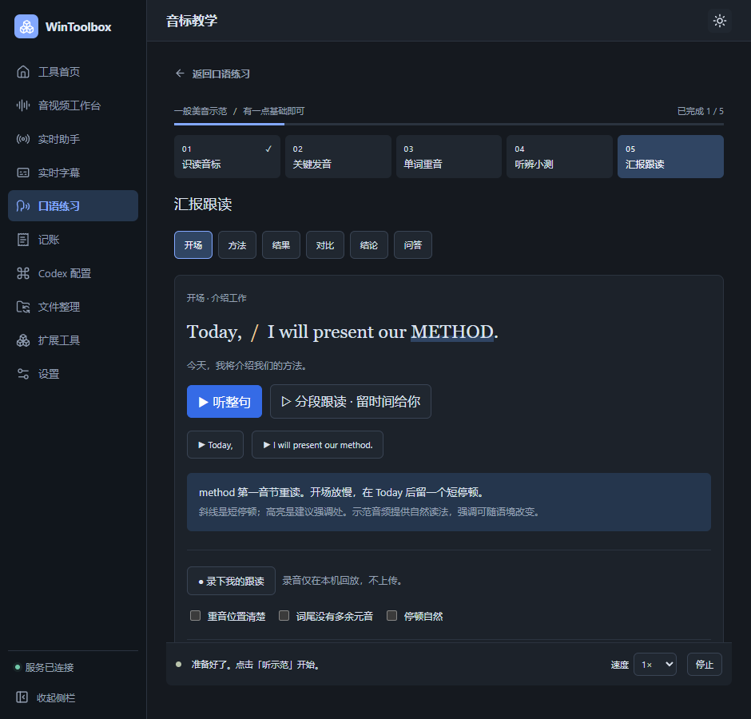

# WinToolbox 0.1.14：音标教学

从“口语练习 → 音标教学”进入。教学与原有段落朗读在同一个工具中，点“返回口语练习”即可继续使用自己的朗读缓存。

| 章节 | 怎么练 |
| --- | --- |
| 识读音标 | 点 method 的音标，查看重音、音节和发音提示，再听示范 |
| 关键发音 | 切换六组易混音，对照口型提示听例词 |
| 单词重音 | 选择学术词的重读部分，查看反馈并跟读 |
| 听辨小测 | 先听再选，共六题；分数表示听辨结果 |
| 汇报跟读 | 听整句或分段，留出时间跟读，也可录音回听 |

课程附带 45 段合成示范音频，可离线播放和慢放，不调用已配置的模型 API。真人发音、口型视频和开源工具保留为可选外部链接。

“完成本节”会保存学习进度。汇报跟读中的“换成我的汇报稿”支持自动保存文字，用 `/` 标停顿、`**关键词**` 标重点。自定义稿的系统朗读依赖电脑可用的英语语音；原有百炼朗读与缓存仍在口语练习页使用。

进度、听辨最佳成绩、自查勾选和汇报稿保存在应用的 `data/practice/phonetics-state.json`，随原有本地备份和 WebDAV 快照迁移。示范音频随程序提供。

录音只在本机临时回听，不上传、不自动评分。离开前用“保存本次录音”选择位置保存；导出的录音不属于自动同步的应用数据。首次录音需允许麦克风权限。

课程来自 CsNotes 的《学术汇报音标微课》，原笔记库文件保持不变。

验证：296 项后端测试通过；状态、消息来源校验、串行保存及导出格式测试通过。46 项隔离界面检查覆盖五章内容、六题听辨、真实示范音频播放、未保存提醒、保存失败重试、录音导出、退出时释放音轨、麦克风授权延迟返回和课程加载中离开。全部 45 个音频均可解码，复制后与原文件哈希一致。界面检查使用模拟应用数据，录音使用合成测试音轨，没有录制用户麦克风。

固定免安装版已更新至 0.1.14，原有 29 个数据文件校验一致。主程序启动并显示音标教学入口；窗口自动化工具随后报 `failed to activate captured window`，重试后仍失败，桌面端课程播放复核未完成。
