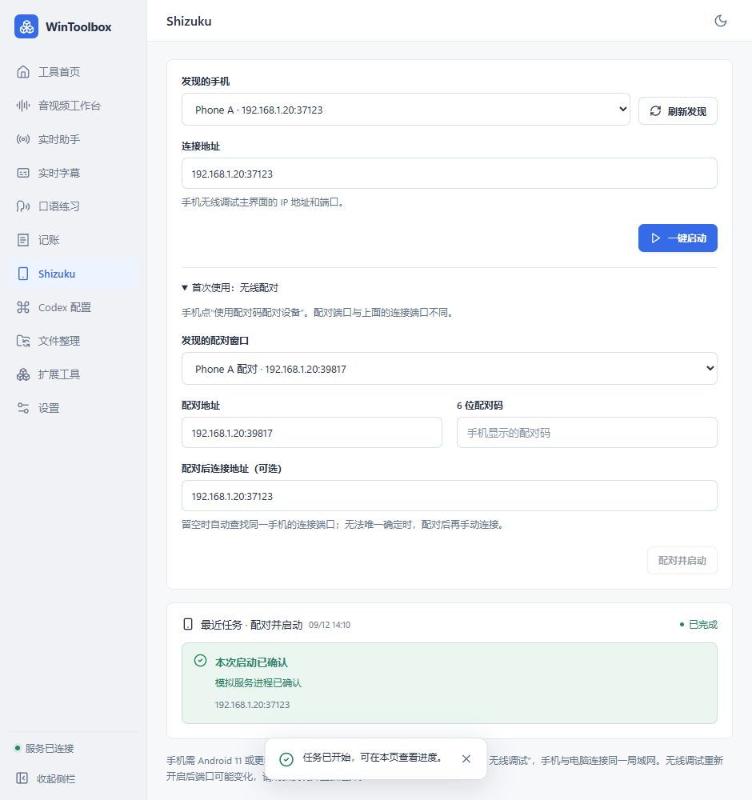

# WinToolbox 0.1.15：Shizuku 无线启动

从侧栏或首页打开 **Shizuku**。ADB 工具已随免安装版提供。

首次使用：

1. 手机安装并打开 Shizuku，开启“开发者选项 → 无线调试”，与电脑连接同一局域网。此方式需要 Android 11 或更新版本。
2. 点击“发现手机”，或在“连接地址”填手机无线调试主界面显示的 **IP:端口**。
3. 展开“首次使用：无线配对”，在手机点击“使用配对码配对设备”。填入该弹窗的 **配对地址**和 **6 位配对码**，保持手机配对弹窗开启。
4. 点击“配对并启动”。能唯一发现同一手机的连接端口时会继续启动；否则提示已配对，补填主界面的连接地址后点“一键启动”。也可提前填入“配对后连接地址”。

**配对端口与连接端口不同。** 地址格式例如 `192.168.1.20:37123`，当前支持常见私网 IPv4 地址。

配对完成后，通常无需再次输入配对码。以后开启手机无线调试，选中手机或使用记住的连接地址，再点“一键启动”。无线调试重新开启、切换网络或手机重启后，端口可能变化，需刷新发现并重新选择。手机撤销电脑配对或换电脑后需重新配对。

软件仅对所选手机执行 Shizuku 官方启动脚本，并检查服务进程后报告启动成功。最近任务的成功记录表示当时已确认，不是持续监控手机状态。

配对码提交后即从输入框清空，不写入任务记录或同步备份。记住的连接地址随设置迁移；ADB 自身的配对凭据保留在本机 Android 工具目录，换电脑仍需配对。取消只停止当前操作，不撤销已经完成的手机配对。

参考：[Shizuku 官方手册](https://shizuku.rikka.app/guide/setup/)、[Android 无线 ADB 架构](https://android.googlesource.com/platform/packages/modules/adb/+/HEAD/docs/dev/adb_wifi.md)。

验证：327 项后端测试、43 项前端断言和 20 项模拟界面检查通过。覆盖设备选择、配对/连接端口区分、未授权、进程未确认、取消、配对码清空与不落库、最近任务语义，以及 ADB 缺失后的恢复。官方 ADB 运行环境已校验并随程序提供。按用户要求，本次未进行手机实机配对或激活测试。

0.1.15 固定免安装目录已更新，原 29 个用户数据文件校验一致；打包后的独立 Python 引擎已确认能找到随包 ADB 37.0.1。
