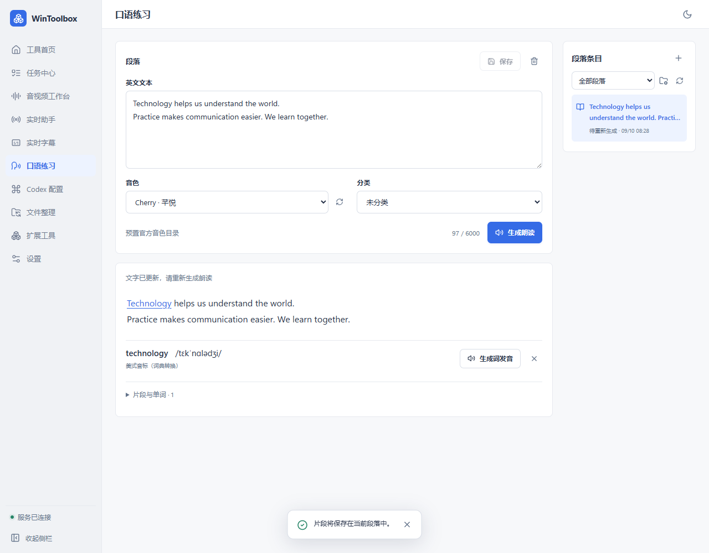

# WinToolbox 0.1.8：口语练习按段落管理

段落是独立条目，可以保存文字、编辑和分类。单词与选段发音归属原段落，播放片段时留在原段落中，不再把每个单词加入段落列表。

分类文件夹支持新建和重命名，段落可移动分类。删除分类后，里面的段落移到“未分类”。删除段落及片段会归档记录，保留恢复所需音频；不会破坏其他段落共享的音频。

编辑文字后可以保存，再生成更新音频；普通生成复用已有句子缓存，明确选择重新生成才再次调用 API。强制生成创建新的音频版本，不覆盖其他条目使用的缓存。文字修改后旧音频明确标为待更新。

声音改为下拉选择。当前 Qwen3-TTS-Flash 提供 48 种官方系统音色，按所选模型过滤，也可填写自定义音色 ID。目录来自百炼官方非实时语音合成音色表（2026-09-10 核对），不是账户克隆音色的动态查询接口。

旧版记录保留在“未分类”，既有音频仍能回放。由于旧版没有记录片段所属关系，不根据相似文字自动合并旧记录；新版生成的片段会随所属段落一起管理。

音色来源：https://help.aliyun.com/zh/model-studio/qwen-tts-voice-list

验证：171 项 Python 全量测试通过。隔离数据目录下使用已配置百炼 API，以 Aiden 完成真实段落与选词合成；重复选词复用缓存，强制生成后普通生成复用新版，编辑保留片段，删除分类移到未分类，删除测试段落留下归档。测试未修改用户已有条目。脚本：`.build/validate_practice018.py`。

使用：在“段落条目”右侧点击 ＋ 新建；在编辑区修改文字后点“保存”。通过“管理分类”新建文件夹，再从“分类”下拉框选择目标并保存。编辑区右上角垃圾桶删除整个段落；展开“片段与单词”后，每个片段可播放、重新生成或删除。已有朗读直接点击播放即可，只有需要新的合成版本时再点“重新生成”。

前端验证：播放器 41 项、段落状态 25 项断言通过；隔离 mock 下 16 项交互与布局检查通过，覆盖保存/放弃修改、分类 CRUD、片段归属及删除。1280 与 940 宽度无横向溢出。界面示例见下图（测试数据）。

最终免安装构建成功，EXE 版本为 0.1.8。原生窗口服务已连接，实际打开官方音色下拉框、删除确认后取消，原有缓存播放进入播放状态并正常到达结束。原有 3 条记录 SHA256 与更新前一致。
