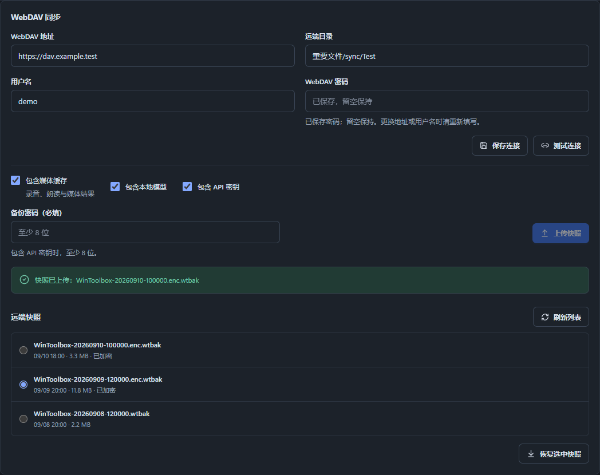

# WinToolbox 0.1.9：WebDAV 同步

设置 → 数据与备份 → WebDAV，可把当前设置、资料库索引、任务记录和口语练习上传为快照，在另一台电脑选择快照恢复。采用手动上传与恢复，不自动合并两台电脑的修改。

1. 填写服务器地址、远端目录、用户名和密码，保存后测试连接。远端父目录需要已经存在，程序可以创建最后一级目录。
2. 点击上传快照。默认包含朗读缓存及媒体文件；模型文件可选。若包含 API 密钥，必须设置至少 8 位的备份密码。
3. 在另一台电脑配置相同连接，刷新快照列表，选择快照后恢复。加密快照需要原备份密码。
4. 恢复会替换快照包含的数据，操作前自动保存本地恢复点；完成后重启工具箱。

每次上传使用独立文件名，保留旧快照。上传未完成的文件不会作为完整快照列出。WebDAV 登录密码由当前 Windows 用户加密保存在本机，不随应用快照上传；第二台电脑需要重新填写连接凭据。同步密码与 API 密钥不会写入任务参数。

示例配置：服务器 `https://dav.example.com`，目录 `sync/WinToolbox`。请在本机填写自己的 WebDAV 地址和账号；这些值不是程序内置服务。

协议依据：[WebDAV RFC 4918](https://www.rfc-editor.org/rfc/rfc4918.html)。

验证：189 项 Python 全量测试通过。真实 fnOS WebDAV 服务器完成目录创建、临时上传与 MOVE 发布、快照列表、下载、隔离恢复与本地恢复点保存；音频 4,844 字节逐字节一致。测试远端子目录已清理，原有用户段落不参与恢复测试。修复了默认 HTTPS 端口出现在 Destination 时触发该反向代理 502 的兼容问题，保留完整快照原子发布流程。

前端构建、27 项状态断言及 24 项隔离交互检查通过，1280/940 宽度无横向溢出。免安装 EXE 为 0.1.9，原生 UI 连接测试和正式上传均通过。首份正式快照 `wintoolbox-20260910T032949Z-8c37f62c627d4b86be42309926c89d12.wtbak` 大小 340,683 字节；重新下载后校验全部 18 个文件的大小及 SHA256，三个原有段落逐字节一致。主题、收藏和媒体缓存已包含，API 密钥与 WebDAV 凭据未包含。

